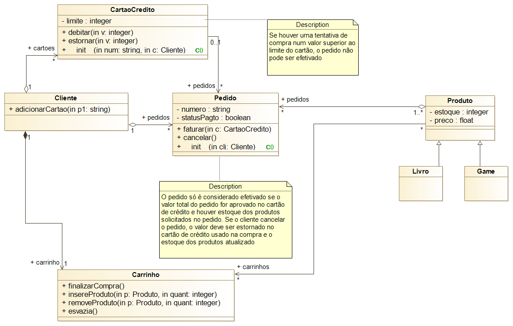

# Projeto de um sistema de e-commerce

A figura a seguir apresenta o diagrama de classes projetado para um sistema de ecommerce. O objetivo da sua equipe de desenvolvimento é implementar todas as classes em Python, incluindo pelo menos dois novos membros privados e seus métodos públicos de acesso para cada classe (use a criatividade). Além disso, implemente também todos os métodos que já estão definidos na interface das classes:

## Cliente
- adicionarCartao(p1: string): **p1** é uma string que representa o número do cartão e este método cria um novo objeto CartaoCredito e o guarda na coleção de cartões do cliente (lista cartoes)

## CartaoCredito
- debitar(v: integer): debita o valor **v** do limite do cartão
- estornar(v: integer): estorna o valor **v** do limite do cartão

## Pedido
- faturar(c: CartaoCredito): fatura o valor do pedido no cartão **c**
- cancelar(): cancela o pedido

## Carrinho
- finalizarCompra(): gera o pedido e tenta faturá-lo
- insereProduto(p: Produto, quant: integer): insere o produto **p** na lista de produtos no carrinho em **quant** unidades
- removeProduto(p: Produto, quant: integer): remove **quant** unidade do produto **p** na lista de produtos no carrinho
- esvazia(): esvazia os produtos do carrinho, isto é, remove todos os produtos

## Observações
- O trabalho será utilizado como parte da avaliação do AT
- O trabalho pode ser feito individualmente. Neste caso, o aluno terá um bônus na sua avaliação do AT, caso ele apresente pelo menos 3 módulos funcionando corretamente (ver tabela abaixo).
- A turma pode também se dividir em grupos para a implementação do projeto como um time de desenvolvimento. Neste caso, sugiro a seguinte configuração dos módulos:

| Módulos              | Escopo de trabalho      |
|----------------------|-------------------------|
| Módulo cliente       | Cliente e Carrinho      |
| Módulo produto       | Produto, Livro e Game   |
| Módulo pagamento     | Pedido e CartaoCredito  |
| Módulo de integração | Testar tudo funcionando |

- Os grupos devem se comunicar para combinarem as interfaces públicas de cada classe
- A responsabilidade de cada grupo é deixar a sua parte (escopo de trabalho) funcionando
- A responsabilidade do grupo de integração é garantir que as partes de todos os grupos funcionem corretamente juntas
- O grupo de integração deve mostrar um programa que reutilize o código dos outros grupos para a seguinte sequencia de operações:
  - Criação de 3 clientes diferentes onde um deles tem 2 cartões de crédito, enquanto os demais apenas um. Os limites dos 4 cartões devem ser diferentes
  - Criação de 4 produtos: 2 livros e 2 games
  - O cliente com dois cartões faz 2 pedidos: um com um livro e um game, e outro com 2 livros
  - Os outros clientes devem fazer 1 pedido cada com 1 livro ou 1 game
  - Mostre um cenário onde o pedido de um dos clientes não é efetivado por falta de limite no cartão
  - Mostre um cenário onde o pedido de um dos clientes não é efetivado por falta do produto no estoque
  - Mostre um cenário onde o pedido do cliente com mais cartões é efetivado corretamente
- Caso você precise de algum ajuste no modelo, solicite ao professor a mudança

## Prazo: 06/12 - os grupos apresentam seus módulos (se o trabalho for individual, basta enviar o link do repositório no github)
> Na data do TP3 (22/11), os grupos devem mostrar uma prévia de como está a implementação do projeto para o professor.

